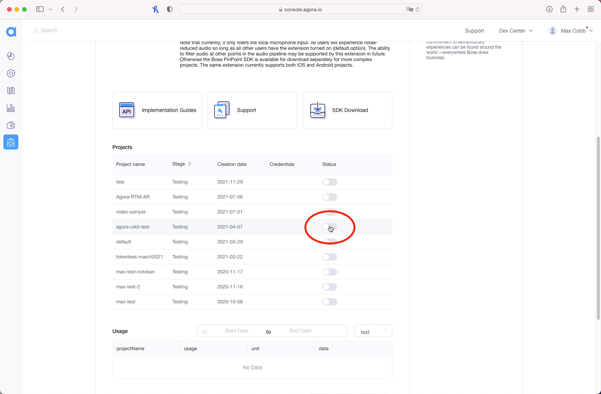

# Create a Voice Isolating Video Call App with SwiftUI

Creating a video call app is super straightforward with Agora's SDK and UIKit, but what about adding cool features to enhance the overall user experience or adding monetisation options? That's where Agora's [Extensions Marketplace](https://console.agora.io/marketplace) comes in.

The Extensions Marketplace launched in September 2021, and already several extensions are available, with more to come.

In this post, we'll show you how to remove background noise from your existing video call app with Bose's PinPoint Extension. With the [Bose PinPoint](https://console.agora.io/marketplace/extension/introduce?serviceName=bose) extension, in just two easy steps you will be able to get rid of background noise:

1. Enable the extension
2. Pass extension credentials

Now, let's get started.

## Prerequisites

- [An Agora Developer Account - Sign up here](https://sso.agora.io/en/signup?utm_source=medium&utm_medium=blog&utm_campaign=create-a-voice-isolating-video-call-app-with-swiftui)
- Xcode 12.3 or later
- A physical iOS device with iOS 13.0 or later
- A basic understanding of iOS development

## Setup

Let’s start with a new, single-view iOS project. Create the project in Xcode, choosing SwiftUI for the interface, and then add the [Agora UIKit](https://github.com/AgoraIO-Community/iOS-UIKit) package.

Add the package by selecting `File > Swift Packages > Add Package Dependency`, and then paste the link into this Swift package:

[`https://github.com/AgoraIO-Community/iOS-UIKit.git`](https://github.com/AgoraIO-Community/iOS-UIKit.git)

When asked for the version, insert `4.0.0-preview`, and select "Up to Next Major". This should install at least version `4.0.0-preview.8`, which is released at the time of writing.

When in doubt, you can always select "Exact" and insert `4.0.0-preview.8`.

---

Once that package installed, the camera and microphone usage descriptions need to be added. To see how to do that, check out Apple's documentation here:

https://developer.apple.com/documentation/avfoundation/cameras_and_media_capture/requesting_authorization_for_media_capture_on_ios#2962313

## Video Call UI

I won't go into much detail about the UI here, because we're mainly focusing on the Bose PinPoint extension, but on a high level:

- The ContentView contains two views: a AgoraViewer (defined in [Agora UIKit](https://github.com/AgoraIO-Community/iOS-UIKit)), and a button to join the channel.
- When the join button is pressed, the Agora UIKit method `join(channel:,with:,as:)` is called, which joins the Agora video channel.

This is what the ContentView looks like:

https://gist.github.com/maxxfrazer/950ad1366cd4f062c93bc189565bc637?file=bose-pinpoint-extension-agoraviewerhelper-initial-swift

And the helper object, `AgoraViewerHelper`, without any of the Bose PinPoint additions looks like this:

https://gist.github.com/maxxfrazer/950ad1366cd4f062c93bc189565bc637?file=bose-pinpoint-extension-contentview-initial-swift

---

We now have a working video call app with SwiftUI and Agora UIKit. The next step is to integrate the Bose PinPoint extension!

## Integrating Bose PinPoint

### Credentials

If you have an account with Agora and are currently signed in, follow [this link](https://console.agora.io/marketplace/extension/introduce?serviceName=bose) to activate the extension for your account.

First, you will need to activate PinPoint for your account by clicking "Activate" here:

<p align="center">
  
</p>

Next, enable PinPoint for the project, the same project as for the Agora App ID used in the app:

<p align="center">
  
</p>

Once that's done, you can grab your Bose PinPoint `API Key` and `API Secret` by clicking “view” below the credentials tab:

<p align="center">
  
</p>


### Add to Xcode

We need to add the extension, which can also be installed via the Swift Package Manager with the following URL:

[`https://github.com/AgoraIO-Community/Extension-Bose-PinPoint-iOS.git`](https://github.com/AgoraIO-Community/Extension-Bose-PinPoint-iOS.git)

> The latest release at the time of writing is `0.0.1`.

This package doesn't need importing into your Swift code. It just needs to be bundled alongside the Agora SDK in your app target.

### Enable the Extension

When using Agora extensions, you need to enable them before joining a channel.

To do this with Agora UIKit, you can call `AgoraVideoViewer.enableExtension()`.

This method needs to be passed the vendor ("Bose"), the vendor extension ("PinPoint") in this case:

```swift
AgoraViewerHelper.agview.viewer.enableExtension(
  withVendor: "Bose", extension: "PinPoint", enabled: true
)
```

The above code snippet is added to the beginning of the `joinChannel` method defined earlier.

### Toggle the Extension

As shown in the above snippet for AgoraViewerHelper, we have added an extra button to the default buttons provided by Agora UIKit.

This button displays the Bose PinPoint logo, and toggles between a green and red background. When clicked, the button calls a method `togglePinpoint`; let's link this button up to enable and disable the extension:

```swift
@objc func togglePinpoint(_ sender: UIButton) {
  pinPointEnabled.toggle()
  sender.backgroundColor = self.pinPointEnabled ? .systemGreen : .systemRed
  AgoraViewerHelper.agview.viewer.enableExtension(
    withVendor: "Bose", extension: "PinPoint", enabled: self.pinPointEnabled
  )
}
```

In the above snippet, all we need to add is the call enableExtension again, with the `enabled` property toggling between `true` and `false`.

---

Almost there now! The only thing left to do is define the `registerPinPoint` method.

This method needs to pass the API Key and API Secret values. These values need to be passed to the extension with the keys `apiKey` and `apiSecret` respectively:

```swift
func registerPinPoint() {
  // Set API Credentials
  AgoraViewerHelper.agview.viewer.setExtensionProperty(
    "Bose", extension: "PinPoint", key: "apiKey", value: AppKeys.pinPointApiKey
  )
  AgoraViewerHelper.agview.viewer.setExtensionProperty(
    "Bose", extension: "PinPoint", key: "apiSecret", value: AppKeys.pinPointApiSecret
  )
}
```

## Conclusion

You now have a video call app complete with the new extension from Bose!

There are other extensions I'd encourage you to try out, and they can all be found here:

https://console.agora.io/marketplace

If you want to create an app from scratch with this extension, the extension can be applied to an application made directly with the Agora SDK. For that you will need to make sure you're using the 4.x version of the SDK. Details can be found here:

https://docs.agora.io/en/video-call-4.x-preview/landing-page?platform=iOS

The methods, such as `setExtensionProperty`, used in this post are adaptations of the SDK's built-in methods relating to extension. They can be found in this file from Agora Video UIKit:

https://github.com/AgoraIO-Community/iOS-UIKit/blob/4.0.0-preview.8/Sources/Agora-UIKit/AgoraVideoViewer%2BAgoraExtensions.swift

## Testing

You can try out this app by following the GitHub link:

https://github.com/AgoraIO-Community/Bose-PinPoint-SwiftUI

## Other Resources

For more information about building applications using Agora SDKs, take a look at the [Agora Video Call Quickstart Guide](https://docs.agora.io/en/Video/start_call_ios?platform=iOS&utm_source=medium&utm_medium=blog&utm_campaign=create-a-voice-isolating-video-call-app-with-swiftui) and [Agora API Reference](https://docs.agora.io/en/Video/API%20Reference/oc/docs/headers/Agora-Objective-C-API-Overview.html?utm_source=medium&utm_medium=blog&utm_campaign=create-a-voice-isolating-video-call-app-with-swiftui).

I also invite you to [join the Agora Developer Slack community](https://www.agora.io/en/join-slack/) to meet with our developer team as well as other like-minded developers and technical enthusiasts.

